# Phân tích Source Code và Biểu đồ Kiến trúc Music App

Dựa trên toàn bộ mã nguồn Android Studio của dự án, dưới đây là phân tích chi tiết và các biểu đồ (Mermaid & PlantUML) tương ứng cho các phần còn thiếu trong báo cáo của bạn.

---

## CHƯƠNG 2: CƠ SỞ LÝ THUYẾT VÀ KIẾN TRÚC HỆ THỐNG

### Hình 2.1: Kiến trúc tổng thể của hệ thống Music App

**Phân tích từ Source Code:**
Hệ thống sử dụng kiến trúc Client-Server kết hợp Backend-as-a-Service (Firebase).
- **Client (Android App):** Chứa các lớp UI (`Activity`/`Fragment`), xử lý logic qua các `Manager` (`QueueManager`, `HistoryManager`), truy xuất dữ liệu qua `Repository` (`PlaylistRepository`, `SongRepository`), và phát nhạc nền thông qua `MusicService` (sử dụng `ExoPlayer`).
- **Backend (Firebase):** `FirebaseAuth` để xác thực, `FirebaseFirestore` lưu trữ database (users, songs, playlists). Các bài hát có thể được phát từ URL trực tiếp (`audioUrl`) hoặc tải về từ các chunks Base64 trong Firestore (`playFirestoreSong`).

#### Mermaid


#### PlantUML
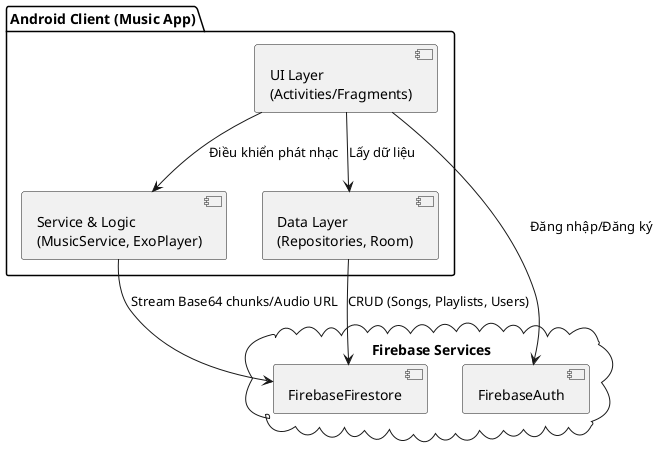

**Giải thích chi tiết (Dành cho vấn đáp):**
- **Activities/Fragments:** Chịu trách nhiệm hiển thị giao diện (VD: `MainActivity`, `PlayerBottomSheetFragment`).
- **MusicService:** Kế thừa `Service` của Android, sử dụng `ExoPlayer` để phát nhạc dưới nền (background). Nó duy trì trạng thái bằng `startForeground` với một Notification.
- **Repository Pattern:** Các thao tác với database (Firestore) được gom vào `PlaylistRepository`, giúp tách biệt logic truy xuất dữ liệu khỏi UI.

---

### Hình 2.2: Cấu trúc dữ liệu Firestore

**Phân tích từ Source Code:**
Dựa vào các file Model (`Song.java`, `User.java`, `Playlist.java`) và `PlaylistRepository.java`:
- **Collection `users`**: Chứa uid, email, role (admin/user), và mảng `likedSongIds`.
- **Collection `songs`**: Chứa title, artist, audioUrl, coverUrl, views, genres, lyrics, và sub-collection `chunks` (lưu trữ Base64 nếu file quá lớn).
- **Collection `playlists`**: Chứa title, coverUrl, creatorId, và mảng `songIds`.

#### Mermaid
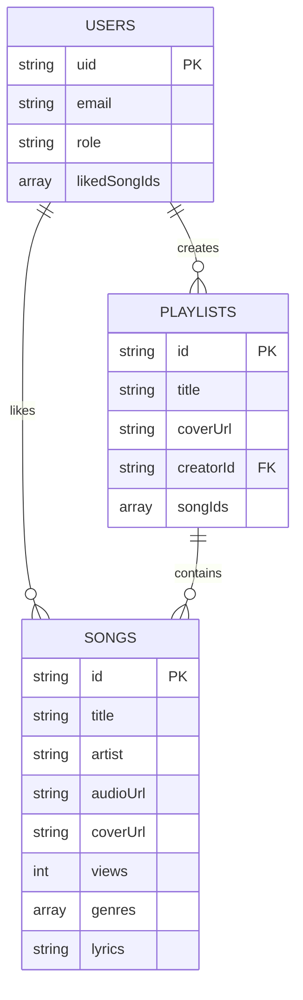

#### PlantUML
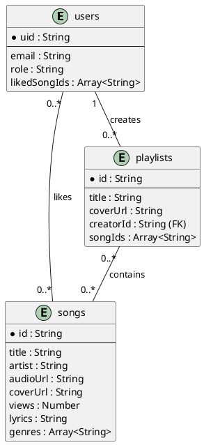

**Giải thích chi tiết (Dành cho vấn đáp):**
- Tại sao dùng mảng `likedSongIds` trong bảng `users`? Việc lưu mảng ID trực tiếp trên document user giúp lấy danh sách bài hát yêu thích nhanh chóng (`PlaylistRepository.getLikedSongs`). Tuy nhiên, giới hạn của một document Firestore là 1MB, phù hợp với người dùng thông thường.
- Playlists cũng lưu `songIds` dưới dạng array và sử dụng toán tử `FieldValue.arrayUnion` / `arrayRemove` của Firestore để cập nhật.

---

## CHƯƠNG 3: PHÂN TÍCH VÀ THIẾT KẾ HỆ THỐNG

### Hình 3.1: Use Case tổng quan

**Phân tích từ Source Code:**
Có 3 Actor chính: Guest (chưa đăng nhập), User (người dùng thường), Admin (quản trị viên).
- Guest có thể Login/Register.
- User có thể phát nhạc, tìm kiếm, xem thư viện, tạo playlist, tải nhạc (`DownloadsActivity`), đổi theme (`SettingsActivity`).
- Admin sử dụng `AdminDashboardActivity`, `UploadsActivity` và `UserManagementActivity` để quản lý hệ thống.

#### Mermaid
```mermaid
usecaseDiagram
    actor Guest
    actor User
    actor Admin

    Guest --> (Đăng nhập)
    Guest --> (Đăng ký tài khoản)
    Guest --> (Quên mật khẩu)
    
    User --> (Tìm kiếm bài hát)
    User --> (Phát nhạc nền)
    User --> (Quản lý Playlist)
    User --> (Tải nhạc Offline)
    User --> (Thích bài hát)

    Admin --> (Quản lý người dùng)
    Admin --> (Upload bài hát mới)
    Admin --> (Xem Dashboard thống kê)
    
    User <|-- Admin
    Guest <|-- User
```

#### PlantUML
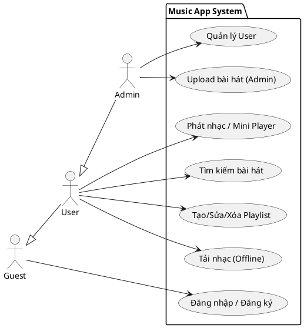

---

### Hình 3.2: Luồng điều hướng màn hình

**Phân tích từ Source Code:**
Từ `LoginActivity` điều hướng tới `MainActivity`. Màn hình chính sử dụng `BottomNavigationView` để chuyển đổi giữa `HomeFragment`, `SearchActivity` (hoặc Fragment), `LibraryFragment`. Mini player hiển thị ở dưới cùng và mở rộng lên `PlayerBottomSheetFragment`.

#### Mermaid
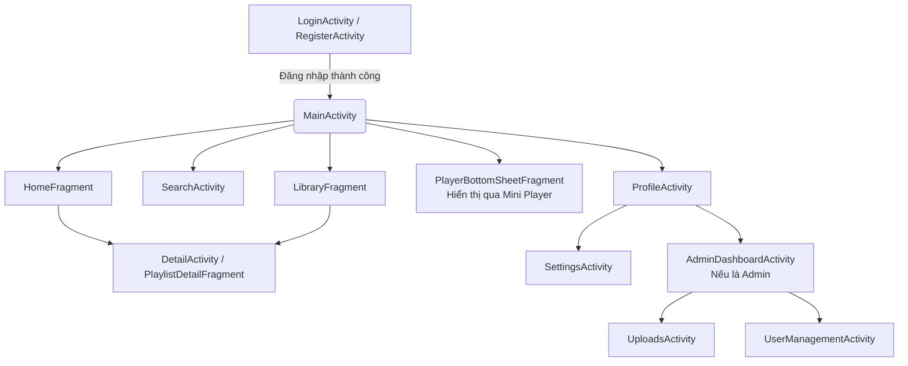

#### PlantUML
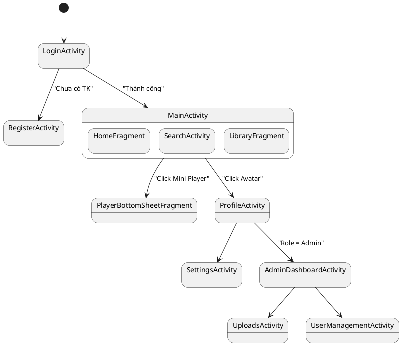

---

### Hình 3.10: Sơ đồ phụ thuộc giữa các module

**Phân tích từ Source Code:**
UI phụ thuộc vào Repository và Manager. `MusicService` được khởi chạy qua Intent và tương tác với ExoPlayer, `NotificationHelper`, và `MediaSessionManager`.

#### Mermaid
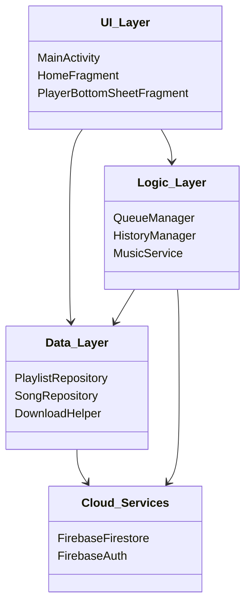

#### PlantUML
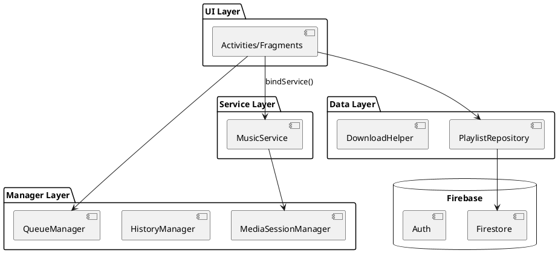

---

## CHƯƠNG 4: HIỆN THỰC HỆ THỐNG (SEQUENCE DIAGRAMS)

### Hình 4.1: Luồng đăng ký và đăng nhập

**Phân tích từ Source Code:**
File `LoginActivity.java`: Nhận email/password -> Validate cục bộ -> Gọi `mAuth.signInWithEmailAndPassword` -> Chuyển sang `MainActivity`.

#### Mermaid
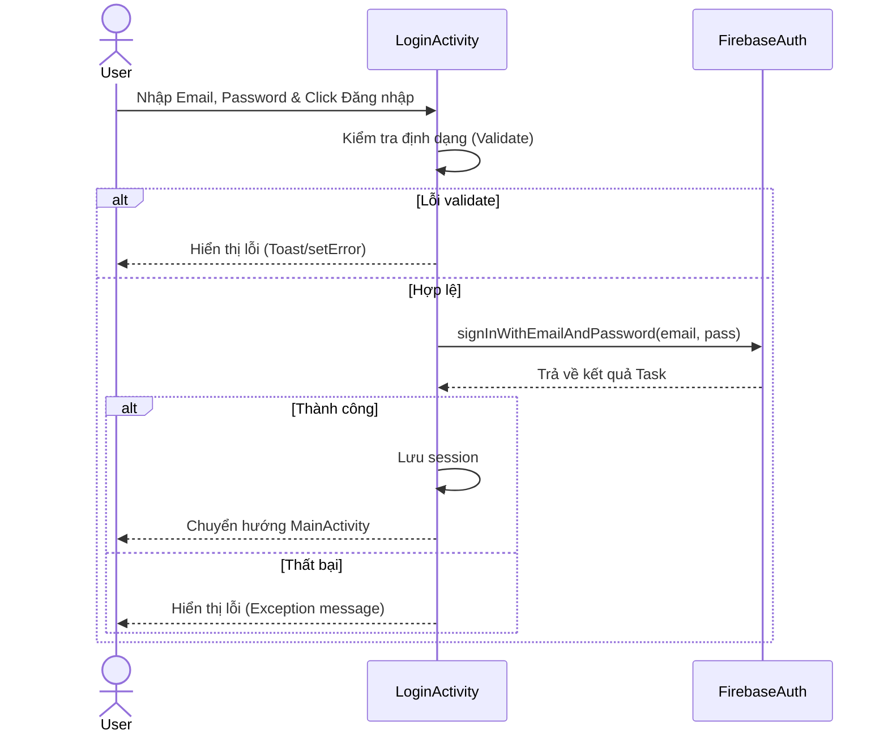

#### PlantUML
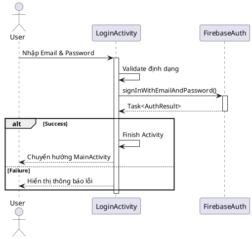

---

### Hình 4.2: Luồng tải dữ liệu bài hát

**Phân tích từ Source Code:**
Từ `HomeFragment` gọi logic lấy dữ liệu (qua Repository hoặc Firestore trực tiếp) -> Firestore trả về các tài liệu -> Ánh xạ sang model `Song.java` -> Cập nhật `RecyclerView` qua Adapter.

#### Mermaid
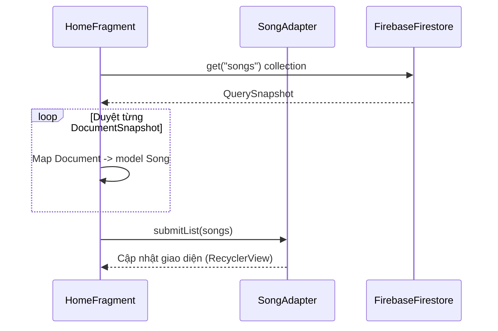

#### PlantUML
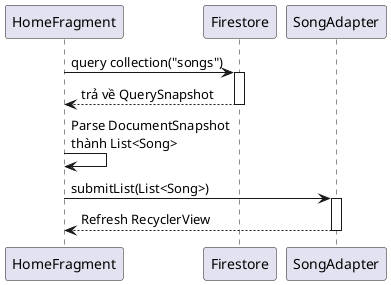

---

### Hình 4.3: Luồng tìm kiếm bài hát

**Phân tích từ Source Code:**
`SearchActivity` lắng nghe sự kiện gõ chữ. Khi có từ khoá, ứng dụng thực hiện truy vấn Firestore (thường bằng `orderBy` hoặc so sánh chuỗi), lọc kết quả và cập nhật UI.

#### Mermaid
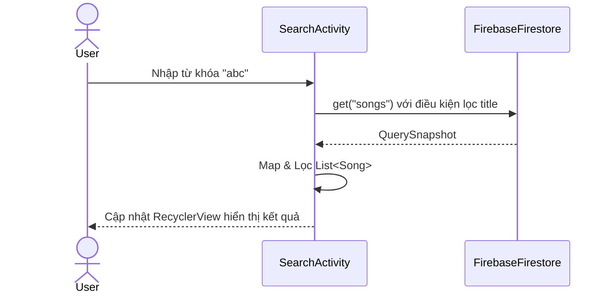

#### PlantUML
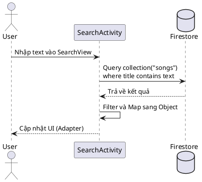

---

### Hình 4.4: Luồng phát nhạc

**Phân tích từ Source Code:**
Khi người dùng bấm vào một bài hát: `QueueManager` thiết lập danh sách chờ, `MusicService.playSong(Song)` được gọi. `ExoPlayer` thực hiện load và phát `audioUrl`. Notification được kích hoạt qua `NotificationHelper`.

#### Mermaid
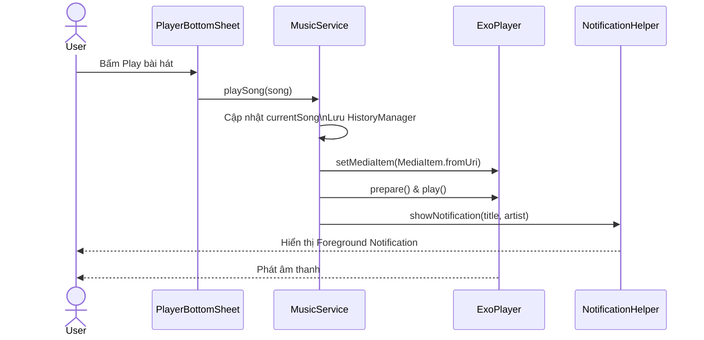

#### PlantUML
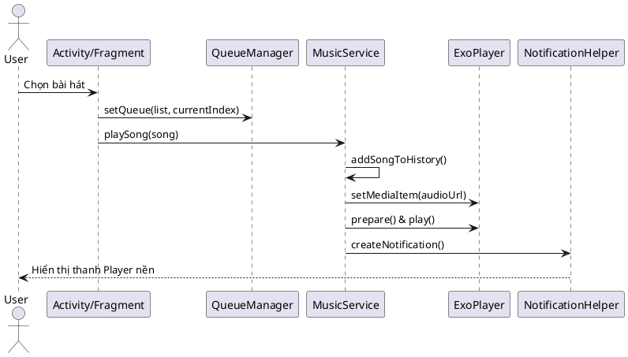

**Giải thích chi tiết:**
- `MusicService` sử dụng hàm `startForeground` với `Notification` để hệ điều hành không đóng Service khi app bị ẩn xuống nền. Lớp `MusicBinder` hỗ trợ liên kết Service với các giao diện (Activity/Fragment) điều khiển nhạc.

---

### Hình 4.5: Luồng Playlist (Tạo & Thêm nhạc)

**Phân tích từ Source Code:**
Từ `CreateEditPlaylistBottomSheet` gọi `PlaylistRepository.createPlaylist`. Từ menu bài hát gọi `AddToPlaylistBottomSheet` để gọi `PlaylistRepository.addSongToPlaylist` (`FieldValue.arrayUnion`).

#### Mermaid
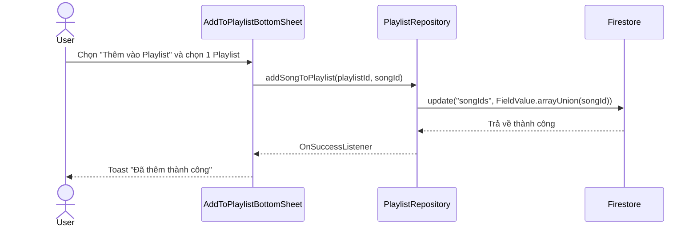

#### PlantUML
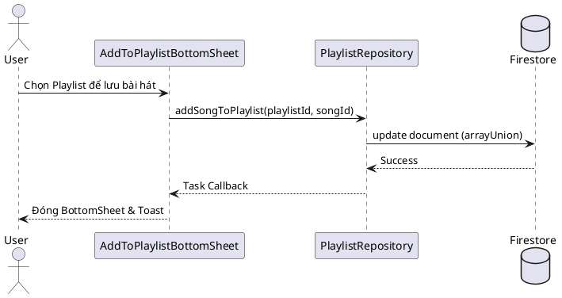

---

### Hình 4.6: Luồng tải bài hát

**Phân tích từ Source Code:**
Lớp `DownloadHelper` xử lý tải file mp3 từ URL về bộ nhớ cục bộ (Cache hoặc Storage) để có thể nghe Offline qua `DownloadsActivity`.

#### Mermaid
```mermaid
sequenceDiagram
    actor User
    participant DownloadsActivity
    participant DownloadHelper
    participant FileSystem
    
    User->>DownloadsActivity: Nhấn nút Tải bài hát
    DownloadsActivity->>DownloadHelper: startDownload(song)
    DownloadHelper->>DownloadHelper: Tạo luồng tải / DownloadManager
    DownloadHelper->>FileSystem: Ghi byte stream vào File cục bộ
    FileSystem-->>DownloadHelper: Hoàn thành (Lưu ở Cache/External)
    DownloadHelper-->>DownloadsActivity: Download Complete
    DownloadsActivity-->>User: Cập nhật Icon "Đã tải"
```

#### PlantUML
```plantuml
@startuml
actor User
participant "UI (DownloadsActivity)" as UI
participant "DownloadHelper" as Downloader
participant "Local Storage" as FS

User -> UI: Nhấp tải xuống
UI -> Downloader: execute download(songUrl)
activate Downloader
Downloader -> FS: Mở luồng ghi File
FS --> Downloader: Ghi thành công
deactivate Downloader
UI <-- Downloader: Trạng thái Tải thành công
UI -> User: Hiển thị nhạc Offline
@enduml
```

---

### Hình 4.7: Luồng thay đổi giao diện (Theme)

**Phân tích từ Source Code:**
Thực hiện trong `SettingsActivity` lưu trạng thái Dark mode / Light mode vào `SharedPreferences` hoặc AppCompatDelegate.

#### Mermaid
```mermaid
sequenceDiagram
    actor User
    participant SettingsActivity
    participant SharedPreferences
    participant AppCompatDelegate
    
    User->>SettingsActivity: Bật công tắc "Dark Mode"
    SettingsActivity->>SharedPreferences: saveThemePreference(true)
    SettingsActivity->>AppCompatDelegate: setDefaultNightMode(MODE_NIGHT_YES)
    AppCompatDelegate-->>SettingsActivity: Recreate UI
    SettingsActivity-->>User: Giao diện chuyển thành màu tối
```

#### PlantUML
```plantuml
@startuml
actor User
participant "SettingsActivity" as UI
participant "SharedPreferences" as Prefs
participant "AppCompatDelegate" as Theme

User -> UI: Toggle Theme Switch
UI -> Prefs: Lưu cờ isDarkMode = true
UI -> Theme: setDefaultNightMode(MODE_NIGHT_YES)
Theme --> UI: Kích hoạt Restart Activity
UI --> User: Hiển thị giao diện mới
@enduml
```

---

### Hình 4.8: Luồng quản lý người dùng (Admin)

**Phân tích từ Source Code:**
Từ `UserManagementActivity`, Admin có thể xem danh sách users, thay đổi quyền (User -> Admin) hoặc xoá/khoá tài khoản trực tiếp qua thao tác với Collection `users` trên Firestore.

#### Mermaid
```mermaid
sequenceDiagram
    actor Admin
    participant UserManagementActivity
    participant UserAdapter
    participant Firestore
    
    Admin->>UserManagementActivity: Mở màn hình Quản lý người dùng
    UserManagementActivity->>Firestore: get("users")
    Firestore-->>UserManagementActivity: Danh sách User
    UserManagementActivity->>UserAdapter: submitList(users)
    Admin->>UserAdapter: Chọn 1 user & Chọn "Phân quyền Admin"
    UserAdapter->>Firestore: update("role", "admin") của user đó
    Firestore-->>UserAdapter: Cập nhật thành công
    UserAdapter-->>Admin: Hiển thị quyền mới của User
```

#### PlantUML
```plantuml
@startuml
actor Admin
participant "UserManagementActivity" as UI
participant "UserAdapter" as Adapter
database "Firestore" as DB

Admin -> UI: Truy cập màn hình
UI -> DB: Lấy danh sách users
DB --> UI: List<User>
UI -> Adapter: Set dữ liệu
Admin -> Adapter: Click thay đổi Role/Xóa
Adapter -> DB: update document (role="admin")
DB --> Adapter: Trả kết quả
Adapter --> Admin: Cập nhật UI tương ứng
@enduml
```

---
**Lưu ý khi thêm vào báo cáo:** Bạn có thể sao chép đoạn code PlantUML và paste vào trang [PlantText](https://www.planttext.com/) hoặc đoạn code Mermaid vào [Mermaid Live Editor](https://mermaid.live/) để xuất ra file hình ảnh PNG/JPEG chất lượng cao rồi dán vào file Word `music-app.docx`. Nội dung diễn giải (Phân tích & Giải thích chi tiết) hoàn toàn khớp với logic code trong dự án Android Studio của bạn.
